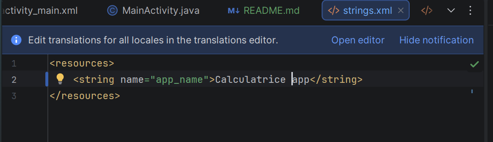
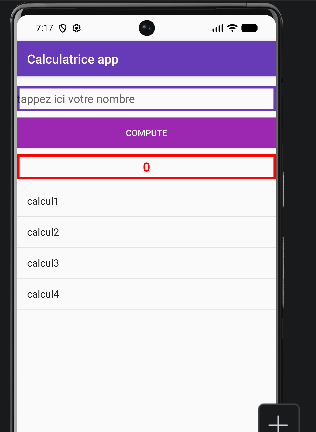
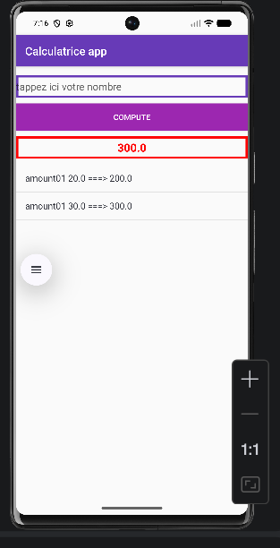

# Activie dapp de calcul
## 1. on commence par  modifier les colors  dans colors dans values stings.xml



## 2. Modifier dans themes thems.xml dans folder themes
theme:Theme.AppCompat.DayNight.DarkActionBar
sstyle= my stayle par exple
```xml
    <style name="Mystyle" parent="Theme.AppCompat.DayNight.DarkActionBar"/>
```
et ajouter les items
ms avant on va dans colors pour ajoute rles colors.xml
par exple
```xml
    <color name="black">#FF000000</color>
    <color name="white">#FFFFFFFF</color>
    <color name="colorPrimary">#673AB7</color>
    <color name="colorPrimaryDark">#512DFF</color>
    <color name="colorAccent">#9C27B0</color>
```

et on retourne a themes.xml pour ajoutr les items
```xml
<resources xmlns:tools="http://schemas.android.com/tools">
    <!-- Base application theme. -->
    <style name="Mystyle" parent="Theme.AppCompat.DayNight.DarkActionBar">
        <!-- Customize your light theme here. -->
         <item name="colorPrimary">@color/colorPrimary</item>
         <item name="colorAccent">@color/colorAccent</item>
         <item name="colorPrimaryDark">@color/colorPrimaryDark</item>
         
    </style>

    <style name="Theme._2BDCCDevMobileActivity2CalculatriceappVersion1AvecProf" parent="Base.Theme._2BDCCDevMobileActivity2CalculatriceappVersion1AvecProf" />
</resources>
```
## 3. modifer nom dapp dans strings.xml
```xml
<resources>
    <string name="app_name">Calculatrice app</string>
</resources>
```

## 4. modifier le nom de style dans android manifest avec celui quon arrive a mettre Mystyle c  le nom de mon style dans themes.xml

```xml
      <application
    android:theme="@style/Mystyle"/>
```

## 5.Creer linterface activty main dans laquel va se faire le calcul

- commencer par faire show interface ui pour voir vos composants 
- click drit+convert view linear view
- cliquer sur le mode split pour ajouter manuellement ou via code les cmpsts et dans palette a gauche vous piuvez ajoutez vos cmpsts manuellemtn 
- number
- btn 
- txtview
- lsit view
- en met le linear layout en  vrtical
- et dans les elts on met match_parent dans width pour quelle prenne tt largeur et on ajoute les id 
- et on met en eux id aussi
- attribut hint: cad placeholder
- gravity pour alignr le contenu

  | Attribut         | Sert à                                 |
  | ---------------- | -------------------------------------- |
  | `gravity`        | position du contenu **à l’intérieur**  |
  | `layout_gravity` | position de la vue **dans son parent** |


diff entre textalignmemtn et gravity pour edit tex

| Attribut        | Valeur      | Comportement                             | Français (LTR) 🇫🇷 | Arabe (RTL) 🇸🇦     |
| --------------- | ----------- | ---------------------------------------- | ------------------- | -------------------- |
| `gravity`       | `right`     | Position **fixe** du texte dans le champ | 👉 Texte à droite   | 👉 Texte à droite    |
| `gravity`       | `left`      | Position **fixe**                        | 👉 Texte à gauche   | 👉 Texte à gauche    |
| `textAlignment` | `viewEnd`   | Dépend de la direction de la langue      | 👉 Texte à droite   | 👉 Texte à gauche 🔄 |
| `textAlignment` | `viewStart` | Dépend de la direction de la langue      | 👉 Texte à gauche   | 👉 Texte à droite 🔄 |
-textcolor et textsize et margiintop
- on personalize aussi des background dans drawable pour edit text et pour txt number style 
- Creer des fich dans drawable aevc le selector selectionne
- puis ajouter le item et dedans shape et sroke

```xml
<?xml version="1.0" encoding="utf-8"?>
<selector xmlns:android="http://schemas.android.com/apk/res/android">
<item>
    <shape android:shape="rectangle">
        <stroke android:color="@color/red" android:width="4dp">
            <size  android:width="40dp"/>
        </stroke>
    </shape>
</item>
</selector>
```
la on peut les utilsier comme des background des text view

Volici la page a creer 

et on les met comme ca puisque il sont dans drawable 
```xml
    <TextView 
        android:background="@drawable/text_view_style"
        android:textStyle="bold"
        />
```
et voila linterface finale

## II. on passe au traitment cote java
pour reccupere une elt par son id vous mettz:
```java
  EditText txtNumber=findViewById(R.id.idTxtNumber);
```
on reccupere tt nos Views de la meme maniere
view=tout élément visible à l’écran
Pour classe R :
- La classe R est une classe générée automatiquement par Android.
- Elle sert à faire le lien entre le code Java/Kotlin et les ressources XML

```bash
📦 Qu’est-ce que “ressources” ?

Ce sont tous les fichiers dans :

res/

Exemples :

- layout (activity_main.xml)
 - images (drawable)
  - textes (strings.xml)
    - couleurs (colors.xml)
    
    ====> La classe R est une classe générée automatiquement qui permet d’accéder aux ressources de l’application.
```


mettre meth setOnclick listener
### pour afficher les donnes dune source de donnees dans un list view on aurra besoin dun adapteur

```text
Un adaptateur sert de pont entre la source de données (comme une liste, un tableau, araylist, cursor, etc.) et le ListView. Il est responsable de fournir les données à afficher dans chaque ligne (ou item) du ListView.
```
Ladapteur prend trois parametres
1. context : via this ou getContext()
- Rôle : Il permet à l'adaptateur de savoir où il se trouve dans l'application.
- Car Si l'adaptateur doit charger des ressources, comme des couleurs ou des chaînes de caractères, il a besoin de savoir dans quel contexte il travaille.
2. layoutResrc(Layout pour chaque élément de la liste)
- Rôle : C’est l’ID de layout XML qui définit l'apparence de chaque élément de la liste.
- Par exemple, si tu veux que chaque élément de la liste soit simplement du texte, tu utiliseras android.R.layout.simple_list_item_1 (un layout de base qui affiche juste du texte).
- Si tu veux personnaliser davantage l'élément, tu peux définir ton propre layout dans un fichier XML.
Y a deux type de layout:
- android.R.layout.simple_list_item_1 : Affiche un seul texte par élément.
- android.R.layout.simple_list_item_2 : Affiche un texte principal et un texte secondaire.
- android.R.layout.simple_list_item_1 : Affiche un seul texte par élément.
  android.R.layout.simple_list_item_2 : Affiche un texte principal et un texte secondaire.
3. data (Source des données)
- Rôle : C’est la liste de données que tu veux afficher dans la liste.
-  Par exemple, une arrayList, un tableau, ou n’importe quel autre type de collection qui contient les informations à afficher.
   L’adaptateur prendra chaque élément de cette collection et l'affichera à l'aide du layout que tu as spécifié.

## AJouter un traitment qund un elt est clique via meth : lst.setOnItemClickListener


### meth setAdapter et notifyAdpetrchangerd

| **Méthode**                  | **Quand l'utiliser**                                                                                                         | **Que fait-elle**                                                                      |
| ---------------------------- | ---------------------------------------------------------------------------------------------------------------------------- | -------------------------------------------------------------------------------------- |
| **`setAdapter()`**           | Lors de la **première initialisation** de l'adaptateur ou lors du **changement d'adaptateur**.                               | Associe un **nouvel adaptateur** à la vue (`ListView`, `RecyclerView`, etc.).          |
| **`notifyDataSetChanged()`** | Quand les **données de l'adaptateur** changent (ajout, suppression, modification) et que tu veux **rafraîchir l'affichage**. | Informe l'adaptateur que les données ont changé et qu'il faut **réactualiser** la vue. |
